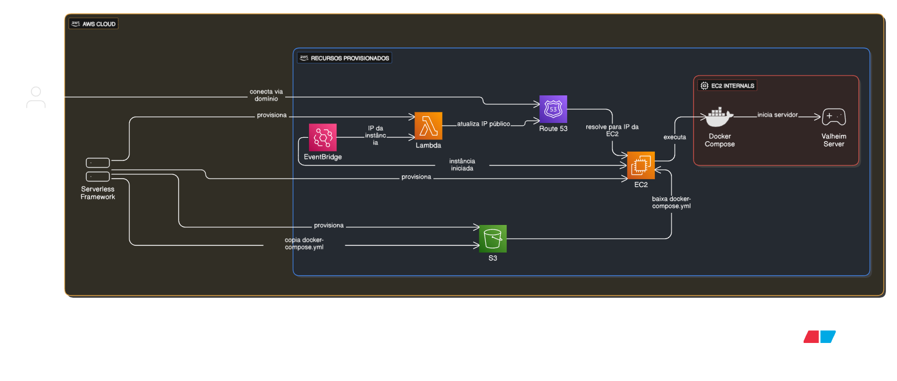

# 🎮 Valheim Server on AWS

Este projeto provisiona e executa um servidor dedicado do **Valheim** utilizando **AWS EC2**, **Docker** e **Serverless Framework**, permitindo rodar a infraestrutura de forma automatizada e escalável.

---

## 🚀 Tecnologias utilizadas

- **AWS EC2** – instância para hospedar o servidor dedicado
- **AWS CloudFormation** – provisionamento de recursos via Serverless
- **Serverless Framework** – automatização do deploy da infraestrutura
- **Docker** – container do servidor Valheim
- **Node.js + TypeScript** – scripts de automação
- **GitHub** – versionamento do código

---

## 🏗 Arquitetura

A infraestrutura funciona da seguinte forma:

- **Serverless Framework** → provisiona EC2, Lambda Function e S3 Bucket.
- **Lambda Function** → faz update do IP dinâmico no domínio.
- **EC2** → quando sobe, baixa o `docker-compose.yml` do S3 e executa.

Se parece com algo assim:

## 

## 📦 Pré-requisitos

Antes de iniciar, você precisa ter instalado localmente:

- [Node.js](https://nodejs.org/)
- [Serverless Framework](https://www.serverless.com/framework/docs/getting-started) configurado
- [AWS CLI](https://docs.aws.amazon.com/cli/latest/userguide/getting-started-install.html) configurado com suas credenciais
- [Docker](https://docs.docker.com/get-docker/)
- Uma _hosted zone_ configurada no Route 53

---

## ⚙️ Como configurar

1. Clone este repositório:

   ```bash
   git clone https://github.com/SEU-USUARIO/valheim-aws-server.git
   cd valheim-aws-server
   ```

2. Instale as dependências:
   ```bash
   pnpm install
   ```
3. Renomeie o arquivo .env.example para .env e configure as variáveis de ambiente:
   ```bash
    HOSTED_ZONE_ID=
    RECORD_NAME=subdomain.my-domain.com
    S3_BUCKET_NAME=super-senha
   ```
4. Configure o arquivo `docker-compose.yml`:
   > Acesse esse link para mais detalhes: [repositório](lloesche/valheim-server-docker)
5. Faça o deploy da infraestrutura com o Serverless:
   ```bash
   sls deploy
   ```

## 🎮 Como acessar o servidor

1. Abra o Valheim
2. Vá em Join Game
3. Insira seu domínio e senha configurados
4. Divirta-se :)

## 🙌 Agradecimentos e Referências

- [lloesche/valheim-server-docker](https://github.com/lloesche/valheim-server-docker) - Imagem docker usada no projeto.

- [Hosting your own dedicated Valheim server in the cloud](https://aws.amazon.com/pt/blogs/gametech/hosting-your-own-dedicated-valheim-server-in-the-cloud/) - Inspiração para a arquitetura adotada.
